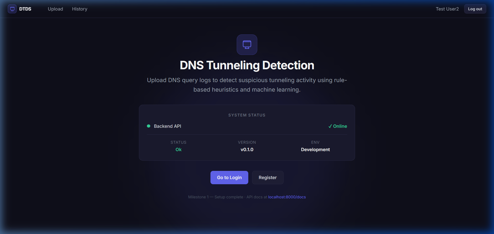
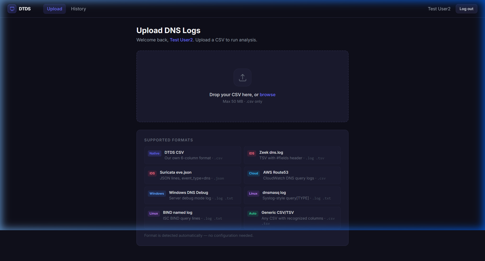
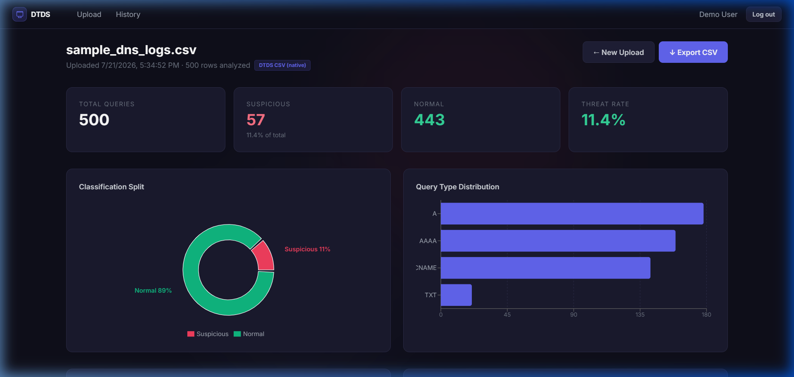
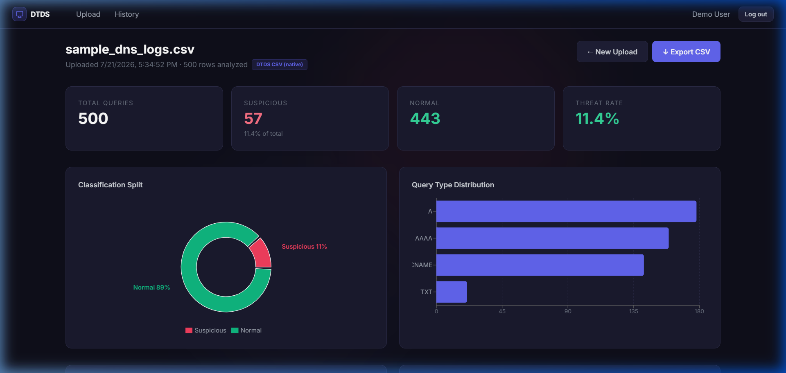
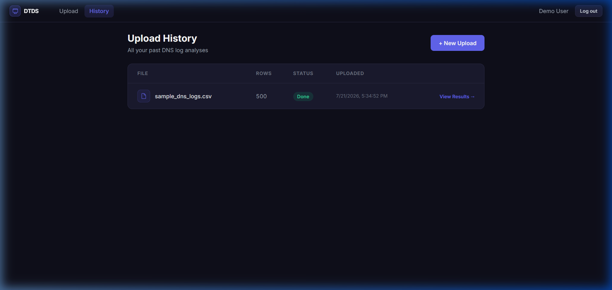
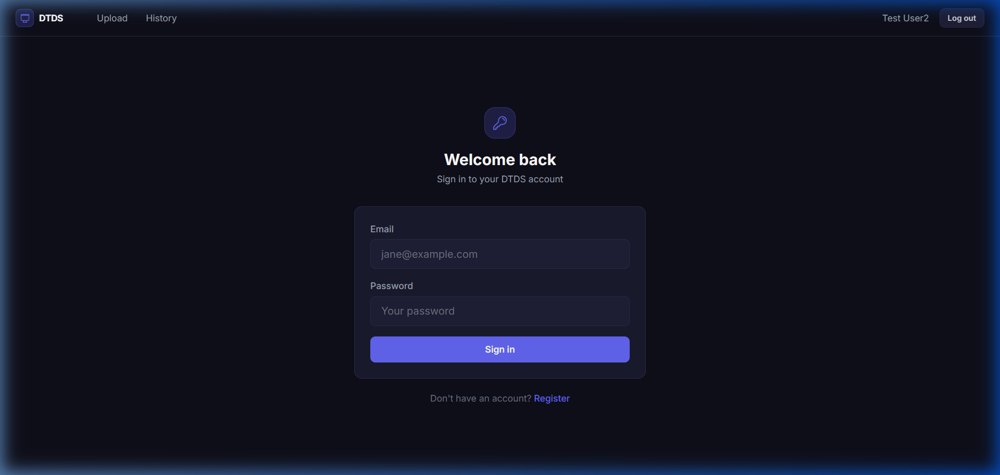
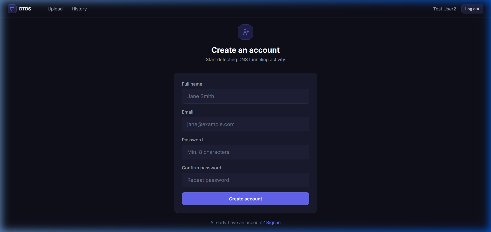

# DNS Tunneling Detection System

A full-stack web application that analyzes DNS query logs to detect data exfiltration and tunneling activity. Upload DNS logs from multiple sources, get instant threat scoring using rule-based heuristics and machine learning, and explore results through interactive charts and a searchable table.

---

## Screenshots

### Dashboard / Home


### Upload DNS Logs


### Analysis Results — Overview & Charts



### Results — Classified Query Table


### Upload History


### Authentication
| Login | Register |
|---|---|
|  |  |

---

## Features

- **Multi-format log ingestion** — Accepts DNS logs from 8 different sources without any configuration
- **Dual-engine detection** — Rule-based heuristics (0–100 score) combined with Isolation Forest anomaly detection
- **Interactive results dashboard** — Pie chart, bar chart, entropy histogram, time-series volume graph, and top suspicious domains list
- **Sortable & paginated results table** — 500 rows per file, full CSV export support
- **User accounts with JWT auth** — Secure registration, login, and per-user history
- **Upload history** — Persistent log of all past analyses with direct links to results
- **Docker-compose deployment** — Three services (frontend, backend, MongoDB) with a single command

---

## Quick Start

**Prerequisites:** [Docker Desktop](https://www.docker.com/products/docker-desktop/)

```bash
git clone https://github.com/Shashwat37/DNS-Tunneling-Detection-System.git
cd DNS-Tunneling-Detection-System

# Copy and configure environment variables
cp .env.example .env
# Edit .env and set a strong JWT_SECRET

docker-compose up --build
```

Open **http://localhost:3000** in your browser.

> **First run** pulls ~400 MB of Docker images (Python 3.11, Node 20, Nginx, MongoDB 7). Subsequent starts use cached layers and take ~5 seconds.

---

## Services

| Service | URL | Description |
|---|---|---|
| Frontend (React + Vite) | http://localhost:3000 | Served by Nginx |
| Backend API (FastAPI) | http://localhost:8000 | Uvicorn ASGI server |
| API Docs (Swagger) | http://localhost:8000/docs | Interactive API explorer |
| MongoDB | localhost:27017 | Persistent named volume |

---

## Supported Log Formats

The system auto-detects the format — no manual selection or configuration needed.

| Format | Extension | Source |
|---|---|---|
| **DTDS Native CSV** | `.csv` | This tool's own 6-column format |
| **Zeek dns.log** | `.log`, `.tsv` | Zeek IDS (TSV with `#fields` header) |
| **Suricata EVE JSON** | `.json` | Suricata IDS (`event_type=dns` entries) |
| **AWS Route 53 Logs** | `.csv` | CloudWatch DNS query logs |
| **Windows DNS Debug** | `.log`, `.txt` | Windows Server DNS debug mode |
| **dnsmasq log** | `.log`, `.txt` | Linux dnsmasq resolver |
| **BIND named log** | `.log`, `.txt` | ISC BIND query lines |
| **Generic CSV/TSV** | `.csv`, `.tsv` | Any file with recognizable column names |

Sample files for each format are included in the repository root (`sample_*.csv`, `sample_*.log`, etc.).

---

## Detection Logic

Each DNS query row is scored **0–100** using rule-based heuristics:

| Signal | Threshold | Score Added |
|---|---|---|
| Subdomain entropy | > 3.5 bits | +30 |
| Subdomain entropy | > 2.5 bits | +15 |
| Domain total length | > 50 chars | +20 |
| Domain total length | > 35 chars | +10 |
| Longest label length | > 30 chars | +20 |
| Label count | > 5 | +10 |
| Numeric character ratio | > 30% | +15 |
| Query frequency (within file) | > 20 | +15 |
| High-risk query type (TXT / NULL / ANY) | — | +20 |
| Query length | > 60 | +10 |
| Subdomain count | > 3 | +10 |
| Response size | < 80 bytes | +10 |

**Score ≥ 40** → classified as `Suspicious`; otherwise `Normal`.

An **Isolation Forest** (scikit-learn, contamination=15%) runs in parallel as a secondary signal, surfaced in the results as `if_anomaly`.

---

## Native CSV Format

For the DTDS Native CSV format, the file must contain these six columns (case-insensitive; extra columns are ignored):

| Column | Type | Description |
|---|---|---|
| `timestamp` | string | ISO 8601 or any parseable datetime |
| `domain` | string | Full FQDN of the query |
| `query_type` | string | DNS record type (A, AAAA, TXT, NULL, …) |
| `query_length` | int | Length of the query payload in bytes |
| `subdomain_count` | int | Number of subdomain labels |
| `response_size` | int | Size of the DNS response in bytes |

A sample file is included: [`sample_dns_logs.csv`](./sample_dns_logs.csv) (500 rows, ~20% synthetic tunneling traffic).

---

## Project Structure

```
DTDS/
├── docker-compose.yml
├── .env.example
├── sample_dns_logs.csv          # Sample data — native CSV format
├── sample_zeek_dns.log          # Sample data — Zeek format
├── sample_suricata_eve.json     # Sample data — Suricata format
├── sample_route53.csv           # Sample data — AWS Route 53
├── sample_bind_named.log        # Sample data — BIND named
├── sample_dnsmasq.log           # Sample data — dnsmasq
├── sample_generic.tsv           # Sample data — generic TSV
├── docs/
│   └── screenshots/             # UI screenshots
├── backend/
│   ├── Dockerfile
│   ├── requirements.txt
│   └── app/
│       ├── main.py              # FastAPI app, CORS, router mounting
│       ├── config.py            # Pydantic settings / env vars
│       ├── db.py                # Motor async MongoDB client
│       ├── models.py            # Request / response schemas
│       ├── dependencies.py      # JWT creation + verification
│       ├── detection.py         # Feature extraction, scoring, Isolation Forest
│       ├── normalizer.py        # Multi-format log parser & normalizer
│       └── routers/
│           ├── auth.py          # POST /auth/register, POST /auth/login
│           ├── uploads.py       # POST /uploads, GET /uploads
│           └── results.py       # GET /results/:id, GET /results/:id/export
└── frontend/
    ├── Dockerfile
    ├── nginx.conf
    └── src/
        ├── App.tsx
        ├── context/AuthContext.tsx
        ├── components/
        │   ├── Navbar.tsx
        │   └── ProtectedRoute.tsx
        └── pages/
            ├── Home.tsx
            ├── Login.tsx
            ├── Register.tsx
            ├── Upload.tsx
            ├── Results.tsx
            └── History.tsx
```

---

## Environment Variables

Copy `.env.example` to `.env` and fill in the values:

```env
MONGO_URI=mongodb://mongo:27017/dtds
JWT_SECRET=<generate with: python -c "import secrets; print(secrets.token_hex(32))">
JWT_ALGORITHM=HS256
JWT_EXPIRE_MINUTES=60
APP_ENV=development
```

---

## Tech Stack

| Layer | Technology |
|---|---|
| Frontend | React 18, Vite 5, TypeScript, TailwindCSS v3, Recharts |
| Backend | FastAPI, Uvicorn, Motor (async MongoDB driver) |
| Auth | JWT (python-jose), bcrypt (passlib) |
| Detection | pandas, numpy, scikit-learn (Isolation Forest) |
| Database | MongoDB 7 |
| Infrastructure | Docker Compose (3 services: frontend, backend, MongoDB) |

---

## API Reference

| Method | Endpoint | Auth | Description |
|---|---|---|---|
| `POST` | `/auth/register` | ❌ | Create a new user account |
| `POST` | `/auth/login` | ❌ | Authenticate and receive a JWT |
| `POST` | `/uploads` | ✅ | Upload a DNS log file for analysis |
| `GET` | `/uploads` | ✅ | List all uploads for the current user |
| `GET` | `/results/{id}` | ✅ | Get analysis results for an upload |
| `GET` | `/results/{id}/export` | ✅ | Download results as CSV |
| `GET` | `/health` | ❌ | Backend health check |

Full interactive API documentation is available at **http://localhost:8000/docs** when the backend is running.

---

## Usage Workflow

1. **Register** at `/register` with your name, email, and password
2. **Login** at `/login` — a JWT is stored in `localStorage`
3. **Upload** a DNS log file at `/upload` (drag-and-drop or click to browse)
4. **View results** at `/results/:id` — metrics cards, interactive charts, and a sortable table
5. **Export** results as a CSV using the Export button on the results page
6. **Review history** at `/history` — all past uploads with status and links to results

---

## Stopping / Cleanup

```bash
# Stop containers, keep MongoDB data
docker-compose down

# Stop containers and delete all data (MongoDB volume)
docker-compose down -v
```

---

## License

MIT
